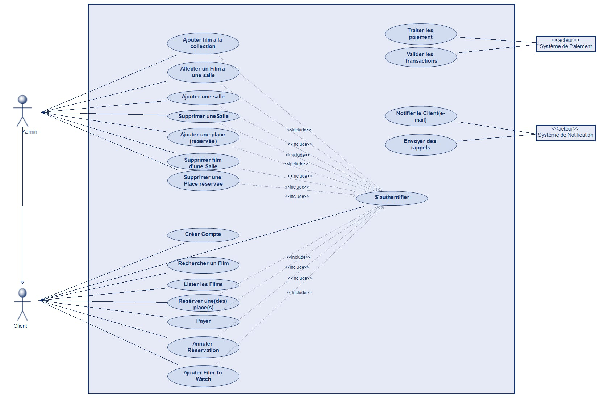
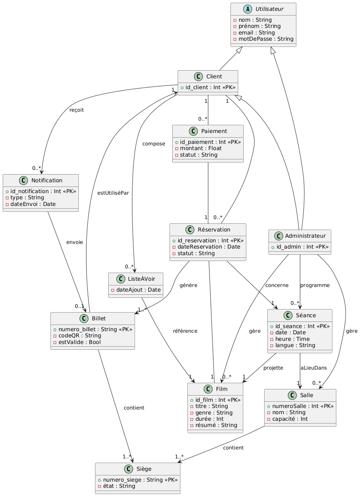
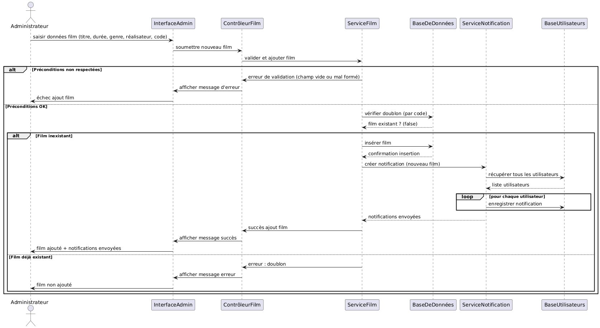

# Billetterie en ligne cinéma à plusieurs salles

**Auteurs :**
- Mohamed Yassine Abdi  
- Youssef Barbouch  
- Mohamed Ali Ben Alaya  

**Date :** 02/04/2025

## Introduction au projet
Ce projet vise à développer une plateforme de billetterie en ligne permettant aux spectateurs de réserver et d’acheter leurs billets facilement, réduisant ainsi les files d’attente et optimisant la gestion des séances. Il inclut la gestion des films, des salles, des réservations et des paiements en ligne sécurisés.  
Nous avons choisi ce projet pour son utilité dans la digitalisation du secteur du divertissement, son potentiel évolutif, et les compétences techniques qu’il permet de développer en gestion de bases de données, UX/UI et paiement en ligne. C'est une opportunité d’apprentissage enrichissante et applicable à d’autres événements culturels.

## Spécification du projet
Le projet consiste en la mise en place d’une billetterie en ligne pour un cinéma multisalles. Il doit offrir une expérience utilisateur fluide et intuitive, permettant aux clients de réserver leurs billets facilement et aux administrateurs de gérer les films, salles et réservations efficacement.

### Contraintes du projet :
- **Accessibilité et ergonomie :** Interface responsive accessible sur ordinateur et mobile.
- **Sécurité :** Paiements sécurisés et protection des données utilisateur.
- **Disponibilité en temps réel :** Gestion dynamique des places et des séances.
- **Notifications :** Système d’alerte pour confirmer les réservations et rappeler les séances.

## Acteurs et fonctionnalités

### 1. Client (Utilisateur principal du service)
- Créer un compte et s'authentifier pour accéder à l’espace personnel.
- Rechercher un film et afficher la liste des films avec filtres (durée, genre, etc.).
- Réserver une place en sélectionnant la salle, la séance, le nombre de places et les sièges.
- Effectuer un paiement sécurisé par carte bancaire.
- Annuler une réservation en cas d’imprévu.
- Ajouter un film à une liste "À voir" pour le retrouver facilement plus tard.

### 2. Administrateur (Gestionnaire du cinéma)
- Ajouter, affecter ou supprimer un film d’une salle selon la programmation.
- Ajouter ou supprimer une salle pour gérer la capacité du cinéma.
- Gérer les places en les marquant comme réservées ou disponibles en cas d’annulation.

### 3. Système de paiement (Traitement des transactions)
- Traiter les paiements et assurer la validation des transactions.
- Gérer les remboursements en cas d’annulation.

### 4. Système de notification (Communication avec les utilisateurs)
- Notifier l’utilisateur par email lors de la confirmation d’une réservation.
- Envoyer des rappels de séance avant l’horaire prévu.

## Diagrammes de cas d’utilisation

### Priorités des cas d’utilisation
Nous avons choisi le cas d'utilisation "Ajouter un film à la collection" pour le sprint 1 car il constitue la fonctionnalité de base nécessaire pour gérer et structurer efficacement les films dans le système.

# Table de décision – Ajouter un film à la collection
précondition :
^ titre du film bien formé (non nul ^ non vide)
^ durée bien spécifiée (non nulle ^ non vide)
^ genre spécifié (non nul ^ non vide)
^ nom  réalisateur bien spécifié (non nul ^ non vide)
^ film avec ce code inexistant dans la collection
postcondition :
^ film avec ce code existant 

|                                                 | 1  | 2  | 3  | 4  | 5  |
|-------------------------------------------------|----|----|----|----|----|
| titre du film bien formé (non nul ^ non vide)   | F  | T  | T  | T  | T  |
| durée bien spécifiée (non nulle ^ non vide)     |    | F  | T  | T  | T  |
| genre spécifié (non nul ^ non vide)             |    |    | F  | T  | T  |
| nom  réalisateur bien spécifié (non nul ^ non vide)  |    |    |    | F  | T  |
| film avec ce code inexistant dans la collection |    |    |    |    | T  |
| film avec ce code existant                     | F  | F  | F  | F  | T  |
| nombre de tests dans le jeu de tests            | 2  | 2  | 2  | 1  | 1  |

# Conception Préliminaire– Rendu 2

**Date :** 10/04/2025  

##  1) Aspects statiques

### 1.a Liste des classes métier

| Classe         | Attributs principaux                                | Remarques / Associations                                                             |
|----------------|------------------------------------------------------|----------------------------------------------------------------------------------------|
| **Cinéma**     | nom                                                  | Agrège les films, salles, séances, utilisateurs                                       |
| **Utilisateur**| nom, prénom, email, motDePasse                      | Classe abstraite                                                                      |
| **Client**     | id_client                                            | Hérite de Utilisateur                                                                 |
| **Administrateur** | id_admin                                       | Hérite de Utilisateur et de Client                                                    |
| **Film**       | id_film, titre, genre, durée, résumé                | Lié aux séances et géré par l'administrateur                                         |
| **Réservation**| id_reservation, dateReservation, statut             | Liée au client, au film, à la séance, génère des billets                              |
| **Paiement**   | id_paiement, montant, statut                        | Associé à une réservation                                                              |
| **Salle**      | numeroSalle, nom, capacité                          | Contient des sièges, accueille des séances                                            |
| **Séance**     | id_seance, date, heure, langue                      | Lie un film à une salle à une date donnée                                             |
| **Billet**     | numero_billet, codeQR, estValide                    | Généré à partir d’une réservation, lié à un client                                    |
| **Siège**      | numero_siege, état                                  | Associé à une salle et à un billet                                                     |
| **Notification** | id_notification, type, dateEnvoi                 | Envoyée à un client, liée à un billet                                                 |

---

### 1.b Diagramme de classes

## 2) Aspects dynamiques

### 2.a Diagramme de séquence – DSUC1 : Ajouter un film à la collection

- **Nom du cas d’utilisation :** Ajouter un film à la collection  
- **Acteur principal :** Administrateur  
- **But :** Ajouter un film dans la base de données du cinéma  

#### Préconditions :
- Titre du film non nul et non vide  
- Durée du film spécifiée (non nulle et non vide)  
- Genre du film spécifié  
- Nom du réalisateur spécifié  
- Le code du film n’existe pas déjà dans la base  

#### Postconditions :
- Le film est enregistré  
- Une notification est envoyée à tous les utilisateurs  

### Algorithme en langage naturel

1. L’administrateur saisit les données du film via l’interface.  
2. Le contrôleur les transmet au service.  
3. Le service valide les préconditions.  
4. Si l’une des conditions n’est pas remplie → échec avec message.  
5. Si tout est OK → on vérifie l’unicité du code.  
6. Si le code existe déjà → échec avec message.  
7. Sinon → on insère le film.  
8. Ensuite → une notification est générée et envoyée à tous les utilisateurs.

### Diagramme de séquence DSUC1

